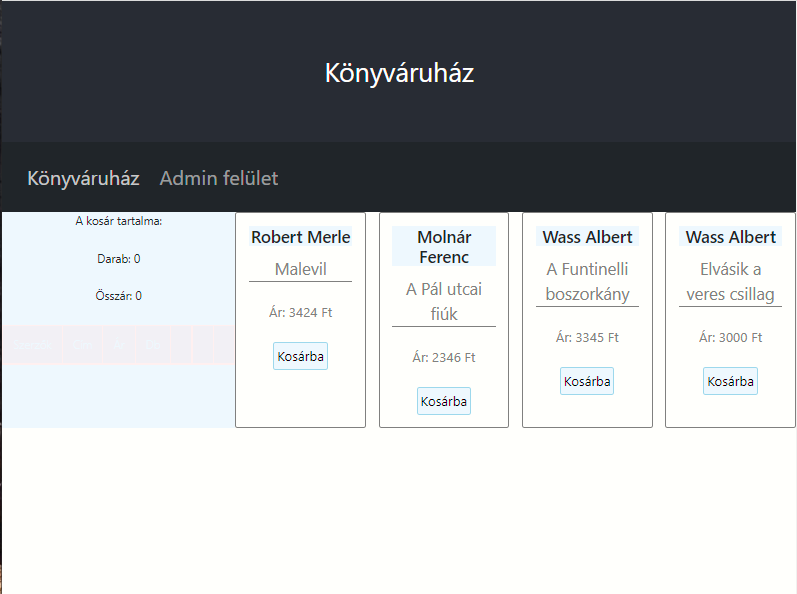
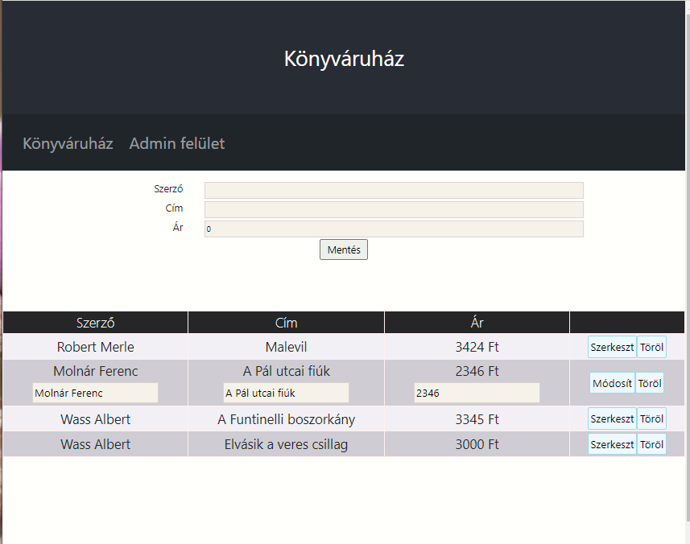

# Egyszerű webáruház kosárral

Egy valós példán keresztül ismerkedünk meg a függvénykomponensek, props-ok és state-k világával.

### `npm start`

A projekt letöltése után az npm start paranccsal tudod futtatni a programot.
Böngészőben az alábbi linken tudod elérni: [http://localhost:3000](http://localhost:3000)

